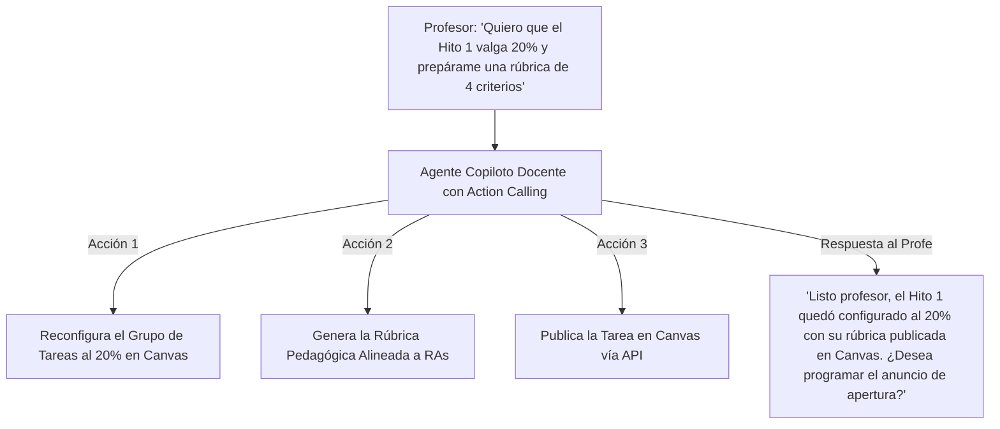

# 🎓 Dossier Ejecutivo: Suite de Docencia Automatizada con IA & Trazabilidad del Aprendizaje
## Documento Oficial de Presentación para Escuelas, Direcciones de Docencia y Decanatos

---

## 📌 1. ¿Qué es exactamente el "Informe de Trazabilidad del Aprendizaje"?

El **Informe de Trazabilidad del Aprendizaje** es el documento maestro que **demuestra con evidencia empírica cómo cada estudiante evolucionó desde el día 1 hasta el examen final**, demostrando el dominio progresivo de los **Resultados de Aprendizaje (RA)** y **Competencias Técnicas** del perfil de egreso.

### 🔍 La Diferencia entre "Historial de Notas" vs. "Informe de Trazabilidad"
* **Historial de Notas tradicional (Canvas Gradebook / Banner / SIS)**: Solo dice: *"El alumno Juan obtuvo 3.5 en la Solemne 1 y 5.0 en la Solemne 2"*. No explica **por qué**, qué habilidades dominó ni dónde tuvo lagunas.
* **Informe de Trazabilidad con IA**: Registra la trayectoria cognitiva completa:
  1. **Diagnóstico inicial** en talleres formativos y ayudantías.
  2. **Interacciones y borradores** analizados por el Agente Tutor IA.
  3. **Brechas detectadas y remediadas a tiempo** (ej. corrección de fallos en bioseguridad, modelado o cálculo antes de la evaluación oficial).
  4. **Correlación de Asistencia + Entregas Formativas + Rendimiento Sumativo**.
  5. **Nivel de logro final por cada Resultado de Aprendizaje (RA)** exigido por el programa.

---

## 🏥 2. Ejemplo Práctico de Trazabilidad (Salud, Ingeniería y Otras Carreras)

### Caso A: Carreras de la Salud (Medicina, Enfermería, Odontología)
* **El Reto**: Un alumno debe demostrar competencia en *"Atención de Urgencia y Manejo de Asepsia"*.
* **Trazabilidad Formativa**:
  - *Semana 3 (Simulación IA)*: El alumno atiende un caso virtual. La IA detecta omisión en el lavado de manos quirúrgico (Criterio Formativo Crítico).
  - *Semana 5 (Taller Clínico)*: El ayudante evalúa con Rúbrica IA en tablet. El alumno aplica el protocolo y recibe feedback inmediato.
  - *Semana 8 (Solemne / ECOE Sumativo)*: El alumno aprueba con 6.5.
* **Resultado en el Informe de Trazabilidad**: Certifica que el alumno no aprobó "por azar", sino que **cerró su brecha procedimental demostradamente antes de interactuar con pacientes reales**.

### Caso B: Carreras de Ingeniería / Negocios / Derecho
* **Ingeniería**: Trazabilidad del código desde el primer commit y borrador hasta la arquitectura final tolerante a fallos.
* **Derecho**: Trazabilidad de la argumentación jurídica y citas jurisprudenciales en simulaciones de litigación formativa.

---

## 📊 3. Estructura del Informe de Trazabilidad que Genera Nuestra Suite

Nuestra plataforma genera automáticamente este reporte para el docente y la escuela en formato PDF / Excel / Dashboard interactivo:

```
================================================================================
           INFORME OFICIAL DE TRAZABILIDAD Y LOGRO DE APRENDIZAJES
                      UNIVERSIDAD DIEGO PORTALES
================================================================================
Curso: 202602 - CIT3203 PROYECTO EN TICS II (Sección 1)
Docente: Prof. Leandro Llanza
Periodo: 2026-02 Semestre Primavera

1. RESUMEN EJECUTIVO DE COHORTE
   - Total Estudiantes: 28
   - Tasa de Retención / Sin Riesgo de Deserción: 96.4%
   - Asistencia Promedio Ayudantías (GPS/QR): 89.2%
   - Horas de Acompañamiento Formativo IA: 142 horas efectivas

2. MATRIZ DE DOMINIO DE RESULTADOS DE APRENDIZAJE (RA)
   -----------------------------------------------------------------------------
   Resultado de Aprendizaje (RA)        | Diagnóstico Formativo | Logro Sumativo Final
   -----------------------------------------------------------------------------
   RA1: Gestión de Alcance (PMBOK)      | 68% (Semana 3)        | 94% (Solemne 1) 🟢
   RA2: Estimación de Costos & Ágil     | 41% (Semana 6) ⚠️     | 88% (Hito 2) 🟢
   RA3: Arquitectura Técnica & Cloud    | 55% (Semana 9) ⚠️     | 91% (Entrega Final) 🟢
   -----------------------------------------------------------------------------
   * Brecha RA2 remediada tras 2 talleres de ayudantía + 18 consultas al Agente Tutor.

3. TRAZABILIDAD INDIVIDUAL & INTERVENCIONES
   - Estudiantes con Alerta Temprana Detectada: 3
   - Intervenciones Aplicadas (Bolsa de Décimas + Refuerzo): 3/3 (100% éxito)
   - Eximición Proyectada: 22 estudiantes (78.5%)
================================================================================
```

---

## 🎯 4. Guion y Estructura para la Presentación a la Escuela (Pitch Deck)

Cuando presentes esta solución ante la Dirección de Escuela o Decanato, utiliza esta estructura de 5 puntos clave:

### Diapositiva 1: El Diagnóstico (El Dolor Actual de los Profesores)
* **Título**: *"Canvas es potente, pero el 80% de los profesores solo lo usa para subir archivos y poner notas finales."*
* **Mensaje**: Crear rúbricas en Canvas toma horas, corregir 80 entregas en SpeedGrader agota a los docentes, y no hay forma fácil de aplicar décimas, talleres formativos ni controlar asistencia real.

### Diapositiva 2: La Solución: Suite de Automatización Docente con IA
* **Título**: *"Un Centro de Mando Inteligente integrado directamente dentro de Canvas."*
* **Mensaje**: No cambiamos de plataforma. Agregamos un botón en el menú de Canvas que automatiza todo el flujo docente:
  1. **Agente Copiloto para el Profesor (Cero Fricción)**: El docente puede pedirle lo que necesita en lenguaje natural (*"Quiero que la Solemne 1 valga 20% y crea una rúbrica de 4 criterios"*) y el Agente ejecuta la configuración en Canvas automáticamente.
  2. **Generador de Rúbricas y Tareas en 1 Clic**: Rúbricas alineadas a Resultados de Aprendizaje publicadas vía API.
  3. **SpeedGrader Copilot con IA (Sin trabajo manual)**: El docente ya no tiene que entrar alumno por alumno a SpeedGrader ni hacer 40 clics por rúbrica; la IA pre-evalúa los entregables y el profesor aprueba por lote con 1 clic.
  4. **Propagación Automática a Grupos (Fix Fallo Canvas)**: Resuelve el error clásico de Canvas donde solo el líder queda con nota; el sistema califica y retroalimenta a todos los integrantes simultáneamente.
  5. **Bolsa de Décimas y Cruce con Asistencia**: Bonificaciones de ayudantías aplicadas automáticamente a las solemnes oficiales.
  6. **Sincronización Transparente con Canvas Gradebook**: Las notas y comentarios oficiales quedan publicados sin discrepancias.

### Diapositiva 3: Formación Formativa vs. Sumativa (La Calidad Educativa)
* **Título**: *"No esperamos a que el alumno repruebe la Solemne: Aseguramos el aprendizaje semana a semana."*
* **Mensaje**: Explicar la diferencia entre evaluación formativa (diagnóstico y feedback continuo del tutor IA) y sumativa (la nota final).

### Diapositiva 4: El Informe de Trazabilidad para Acreditación (CNA / Comisiones)
* **Título**: *"Evidencia empírica de cumplimiento del perfil de egreso en 1 solo clic."*
* **Mensaje**: La escuela ya no tendrá que perseguir a los profesores a fin de semestre para armar carpetas de curso. La plataforma entrega el informe completo de trazabilidad de competencias listo para auditorías.

### Diapositiva 5: Modelo Tecnológico Seguro y Escalable
* **Título**: *"Integración Nativa LTI 1.3 + SaaS Independiente para otras Facultades."*
* **Mensaje**: Cumple con estándares de privacidad de datos, RBAC institucional, y permite escalarlo a toda la universidad o licenciarlo como producto EdTech.

---

## 🏛️ 5. Resumen de Valor por Stakeholder

| Stakeholder | ¿Qué gana con nuestra Suite? |
| :--- | :--- |
| **Docente** | Ahorra 10+ horas semanales en creación de rúbricas, corrección repetitiva y cálculos de Excel. |
| **Estudiante** | Recibe feedback constructivo inmediato de la IA antes de entregar, gana décimas trazables y nunca queda desamparado. |
| **Director de Escuela / Decano** | Visibilidad en tiempo real de qué ramos tienen riesgo de deserción o reprobación, y reportes de acreditación instantáneos. |
| **Universidad (UDP / Institución)** | Posicionamiento como institución pionera en Inteligencia Artificial aplicada a la docencia de vanguardia. |

---

## 🔍 6. Anatomía del Problema: ¿Por qué Canvas Gradebook es Tan Pesado e Inútil para los Profesores?

Uno de los mayores argumentos para convencer a la Escuela es explicar **por qué la herramienta nativa de Canvas falla en la práctica**:

### 1. Origen en el Sistema Escolar de EE.UU. vs. Realidad Chilena
* **Canvas fue diseñado para EE.UU.**: Calificaciones en letras (**A, B, C, D, F**), cálculo de **GPA (0.0 a 4.0)**, curvas estadísticas y percentiles.
* **El choque con la realidad chilena**: Cuando se intenta usar la escala **1.0 a 7.0 con 60% de exigencia y Punto Base 1.0 obligatorio**, Canvas colapsa en esquemas de calificación (*Grading Schemes*) crípticos, redondeos distorsionados y menús ocultos.

### 2. Ceguera ante la Dinámica Real de una Cátedra Universitaria
* **No entiende qué es una "décima"**: Si el ayudante regala 3 décimas por taller, el profesor debe sumarlas a mano en un Excel externo.
* **No sabe calcular la regla de eximición**: Incapaz de cruzar automáticamente que *si Nota $\ge$ 5.0 y Asistencia $\ge$ 75% $\rightarrow$ Eximido*.
* **No entiende la condición de RI**: No bloquea ni etiqueta automáticamente a los estudiantes reprobados por inasistencia ($<75\%$).
* **Castiga las actividades formativas**: Para crear una tarea sin nota, Canvas exige asignarle ponderación 0%, lo que confunde a los estudiantes creyendo que es "inútil".

### 3. La Confusión entre "Módulo de Tareas" vs. "Módulo de Evaluaciones"
* En Canvas existen dos menús separados: *Tareas* (para subir archivos) y *Evaluaciones* (para cuestionarios). El docente nunca sabe cuál usar.
* **Nuestra Solución**: Un **único Creador Inteligente de Actividades con IA** que genera el enunciado, la pauta y la rúbrica, y la publica automáticamente en Canvas vía API en el lugar exacto.

---

## ⚖️ 7. Punto Base Oficial UDP (1.0 Obligatorio y Parametrizable)

La plataforma integra de forma nativa la **fórmula oficial de la Universidad Diego Portales**:
* **Puntaje 0 pts**: Otorga exactamente el **Punto Base 1.0**.
* **Puntaje de Corte (60%)**: Otorga la nota de aprobación **4.0**.
* **Puntaje Máximo**: Otorga la nota máxima **7.0**.

$$\text{Tramo } 0 \text{ a } 60\%: \quad \text{Nota} = \text{PuntoBase} + (4.0 - \text{PuntoBase}) \times \frac{\text{PuntajeObtenido}}{\text{PuntajeCorte}}$$
$$\text{Tramo } 60\% \text{ a } 100\%: \quad \text{Nota} = 4.0 + (7.0 - 4.0) \times \frac{\text{PuntajeObtenido} - \text{PuntajeCorte}}{\text{PuntajeMax} - \text{PuntajeCorte}}$$

*(Incluye un panel de administración con simulador en tiempo real para ajustar el Punto Base si se licencia a otras instituciones).*

---

## 🤖 8. El Agente Copiloto para el Profesor: "Cero Curva de Aprendizaje"

El factor más revolucionario para los profesores que no son tecnológicos o que no quieren perder tiempo en menús:



### Capacidades del Copiloto Docente:
1. **Configuración por Lenguaje Natural**: El docente habla o chatea con su copiloto en lugar de buscar botones o navegar por 5 pantallas de Canvas.
2. **Asesor Pedagógico y Didáctico**: Si el docente no sabe cómo evaluar una competencia, el agente le sugiere metodologías activas (estudio de casos, debates, proyectos por hitos).
3. **Ejecutor Silencioso**: Realiza las llamadas a la API de Canvas, actualiza el cronograma, calcula décimas y prepara borradores de anuncios.


