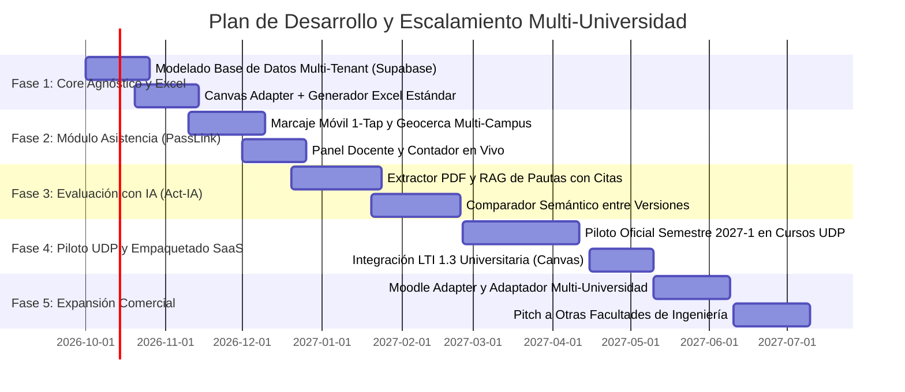

# 📑 Investigación Estratégica, Arquitectura Modular y Hoja de Ruta
## Ecosistema Docente Inteligente (Act-IA + PassLink)
### Plataforma Modular, Agnóstica de LMS y Multi-Universidad (SaaS / EdTech)

---

## 🧭 1. Resumen Ejecutivo y La Visión de la "Revolución Docente"

La educación universitaria actual sigue operando bajo dinámicas tradicionales, manuales e ineficientes: firmas en hojas de papel para asistencia, planillas Excel desordenadas y dispares entre cátedras, y semanas de atraso en la corrección de avances de proyectos donde los ayudantes se sobrecargan y pierden la trazabilidad de las entregas.

Este proyecto propone una **transformación integral de la docencia universitaria** a través de una suite moderna que complementa y potencia la infraestructura existente en cualquier casa de estudios:

```
┌──────────────────────────────────────┐        ┌──────────────────────────────────────┐
│       LMS INSTITUCIONAL              │        │    NUESTRA PLATAFORMA INTELIGENTE    │
│  (Canvas, Moodle, Blackboard, etc.)  │  ◄──►  │    (Rol: Motor Operativo y Dinámico) │
├──────────────────────────────────────┤        ├──────────────────────────────────────┤
│ - Subir diapositivas y lecturas      │        │ - Asistencia anti-fraude en 1 toque  │
│ - Anuncios institucionales           │        │ - Pre-corrección de entregas con IA  │
│ - Foros y repositorio estático       │        │ - Generador del Excel Estándar       │
│ - Base de datos oficial de alumnos   │        │ - Trazabilidad y analítica de avance │
└──────────────────────────────────────┘        └──────────────────────────────────────┘
```

> **El Principio de Especialización**:  
> El **LMS (Canvas, Moodle, etc.)** se mantiene para lo que funciona bien: *almacenar contenido, lecturas y anuncios oficiales*.  
> **Nuestra Plataforma** se encarga de lo que al LMS le falta y donde es deficiente: *asistencia inteligente en tiempo real, evaluación formativa iterativa asistida por IA y estandarización de planillas*.

---

## 🌐 2. Visión Multi-Universidad y Arquitectura Modular (SaaS / B2B EdTech)

Para evitar atarse exclusivamente a una institución (UDP) y permitir la **comercialización o licenciamiento del servicio a otras universidades y facultades de ingeniería** (como UChile, PUC, USACH, UAI, etc.), el sistema se concibe bajo principios de diseño de software empresarial:

```
┌────────────────────────────────────────────────────────────────────────┐
│                      CAPA MULTI-TENANT (INSTITUCIONES)                 │
│         [ UDP ]        [ PUC ]        [ U. de Chile ]      [ Privadas ] │
└───────────────────────────────────┬────────────────────────────────────┘
                                    │
                                    ▼
┌────────────────────────────────────────────────────────────────────────┐
│                   PATRÓN DE ADAPTADORES DE LMS                         │
│  ┌─────────────────┐  ┌─────────────────┐  ┌────────────────────────┐  │
│  │ Canvas Adapter  │  │ Moodle Adapter  │  │ Blackboard/D2L Adapter │  │
│  │ (REST API / LTI)│  │ (WebServices)   │  │ (LTI 1.3 Advantage)   │  │
│  └─────────────────┘  └─────────────────┘  └────────────────────────┘  │
│  └──────────────────────────────────────────────────────────────────┘  │
│  │ Standalone Mode: 100% Funcional sin LMS (Vía Excel Estándar / CSV) │  │
└───────────────────────────────────┬────────────────────────────────────┘
                                    │
                                    ▼
┌────────────────────────────────────────────────────────────────────────┐
│              CORE MODULAR DE SERVICIOS INDEPENDIENTES                  │
├───────────────────────────────┬────────────────────────────────────────┤
│     SERVICIO 1: PASSLINK      │         SERVICIO 2: ACT-IA             │
│   (Presencia & Anti-Fraude)   │      (Agentes de Pautas y Diff)        │
│   - Standalone o API B2B      │      - Agente de Revisión como API     │
├───────────────────────────────┴────────────────────────────────────────┤
│           SERVICIO 3: DATA STANDARDIZATION & EXCEL ENGINE              │
│   - Normalizador multi-país (RUT, DNI, ID Alumno)                      │
│   - Escalas de calificación configurables (1.0-7.0, 0-100, A-F)        │
└────────────────────────────────────────────────────────────────────────┘
```

### Principios de Diseño para la Independencia:
1. **Zero Hardcoding Institucional**: Ninguna regla de negocio lleva texto quemado como `"udp.cl"` o `"UDP"`. Todo se resuelve por configuración de *Tenant*:
   - Dominio de correo institucional permitido (`@mail.udp.cl`, `@uc.cl`, etc.).
   - Polígono de geocerca del campus o sede.
   - Algoritmo de validación de documento de identidad (RUT chileno, DNI peruano/español, o Student ID numérico).
   - Escala de notas (Chile de 1.0 a 7.0 con nota 4.0 de aprobación; o escalas de 0 a 10 / 0 a 100).
2. **Patrón Adaptador de LMS (LMS-Agnostic)**:
   - Si la universidad usa **Canvas**, se activa el `CanvasAdapter`.
   - Si usa **Moodle** (muy extendido en universidades estatales), se activa el `MoodleAdapter`.
   - Si la universidad no permite acceso a su LMS, la plataforma opera en **Modo Autónomo (Standalone)** a través del cargador y generador de Excel.
3. **Agentes y Módulos como APIs (Headless / API-First)**:
   - Cada módulo puede venderse por separado: una facultad puede contratar **únicamente el módulo de Asistencia**, contratar **únicamente el agente de revisión Act-IA**, o la **Suite Completa**.

---

## 👥 3. Experiencia de Usuario Diferenciada por Rol y Dispositivo

Para eliminar la fricción de adopción, la interfaz y los flujos están optimizados según el contexto de uso real:

### 3.1. Portal del Estudiante

```
                     ┌─────────────────────────────────────────┐
                     │          LOGIN ESTUDIANTE               │
                     │    (Email Institucional / Single Sign-On)│
                     └────────────────────┬────────────────────┘
                                          │
                  ┌───────────────────────┴───────────────────────┐
                  ▼                                               ▼
     ┌────────────────────────┐                     ┌────────────────────────┐
     │      VISTA MÓVIL       │                     │    VISTA PC / DESKTOP  │
     │ (Optimizado Asistencia)│                     │ (Optimizado Tareas/IA) │
     ├────────────────────────┤                     ├────────────────────────┤
     │ - 1-Tap Check-In       │                     │ - Subida de PDF/docs   │
     │ - Validación GPS sala  │                     │ - Visor de pauta       │
     │ - Temporizador activo  │                     │ - Feedback IA completo │
     │ - Confirmación visual  │                     │ - Historial de notas   │
     └────────────────────────┘                     └────────────────────────┘
```

1. **En el Smartphone (Vista Móvil)**:
   - **Enfocada 100% en la Asistencia Presencial (PassLink)**.
   - Acceso ultrarrápido (PWA / Web Mobile).
   - Un botón gigante central de marcaje que valida geocerca GPS nativa en milisegundos.
   - El estudiante no tiene que navegar menús complejos dentro de la sala de clases: entra al link del curso, marca y guarda su teléfono.
2. **En el Computador / Laptop (Vista Desktop)**:
   - **Enfocada en el Trabajo Académico y Evaluaciones (Act-IA)**.
   - Espacio amplio para arrastrar y subir informes, talleres y avances en PDF.
   - Visualización clara de la rúbrica oficial y del **feedback detallado entregado por el agente de IA** (citas textuales, qué corregir respecto a la versión anterior, qué observaciones faltaron por resolver).
   - Historial de versiones y métricas de avance personal.

---

### 3.2. Portal de Profesores y Ayudantes (Dueños del Curso)

El equipo docente cuenta con un panel de control con privilegios de gestión total:
- **Gestión de Sesión en Vivo**: Contador de cabezas en tiempo real, detector de dispositivos duplicados y anulación manual inmediata.
- **Centro de Evaluación con IA**: Rúbricas interactivas donde la IA propone puntaje y observaciones fundadas, y el docente/ayudante solo confirma o edita antes de publicar la nota.
- **Sincronización Total**: Botón para empujar las notas directamente al *Gradebook* del LMS y descargar el Excel estándar consolidado.

---

## ⚙️ 4. El Flujo "Configura una vez, automatiza todo el semestre"

Uno de los mayores atractivos para que los profesores y facultades apoyen la plataforma es que **reduce su carga laboral drásticamente sin exigir trabajo repetitivo**:

```
                              INICIO DE SEMESTRE (10 Minutos)
   ┌──────────────────────────────────────────────────────────────────────────────────┐
   │ 1. IMPORTAR CURSO: El profesor extrae su curso del LMS en 1 clic (o sube lista)  │
   │ 2. HORARIOS: Configura días y bloques de clase/ayudantía (ej. Martes 08:30-10:00)│
   │ 3. PAUTAS: Sube o define las rúbricas de las entregas del semestre               │
   │ 4. AUTO-GENERACIÓN: El sistema crea el "Excel Estándar Oficial del Curso"         │
   └────────────────────────────────────────┬─────────────────────────────────────────┘
                                            │
                                            ▼
                             DURANTE TODO EL SEMESTRE (Piloto Automático)
   ┌──────────────────────────────────────────────────────────────────────────────────┐
   │ • Asistencia programada: Se habilita sola según los horarios fijados              │
   │ • Control anti-fraude: Vinculación de dispositivo y geocerca activas             │
   │ • Pre-corrección de entregas: El agente de IA revisa cada PDF contra la anterior │
   │ • Actualización constante: El Excel Estándar y el LMS se mantienen al día       │
   │ • Supervisión docente: El profesor solo audita, valida y aprueba                 │
   └──────────────────────────────────────────────────────────────────────────────────┘
```

---

## 📊 5. El "Generador de Excel Estándar del Curso"

### 5.1. El Dolor Resuelto
Hoy en día, cada ramo y cada facultad maneja formatos incompatibles de Excel (algunos con RUT con guion, otros sin puntos, nombres cortados, columnas cambiadas). Esto genera caos al reportar inasistencias o pasar notas finales a la Dirección de Registro Académico.

### 5.2. Cómo Funciona el Estándar
1. **Extracción desde el LMS (Canvas API / Moodle)**:
   - Descarga la nómina institucional oficial de los alumnos matriculados (`lms_id`, `Identificador normalizado`, `Nombres`, `Apellidos`, `Correo`).
2. **Alternativa Manual Tolerante a Fallos**:
   - Si el profesor no usa LMS, sube cualquier archivo Excel/CSV en bruto. El sistema detecta automáticamente las columnas y normaliza los datos.
3. **Generación del Archivo Canónico**:
   - La plataforma descarga un `.xlsx` pre-configurado profesionalmente:
     - **Pestaña 1: Resumen y Asistencia**: Fórmulas nativas de Excel calculando `% Asistencia`, formato condicional automático (resalta en rojo < umbral para alerta temprana de reprobación).
     - **Pestaña 2: Registro de Clases**: Fechas de todo el semestre pre-pobladas según los horarios definidos.
     - **Pestaña 3: Registro de Entregas Act-IA**: Columnas con ponderaciones oficiales y notas auditadas.
     - **Protección de Cabeceras**: Evita que los ayudantes borren fórmulas por error accidental.

---

## 🛡️ 6. Matriz de Seguridad y Anti-Fraude en Asistencia (PassLink)

Para que cualquier universidad confíe plenamente en el sistema y reemplace el papel de forma definitiva:

| Vector de Fraude Tradicional | Cómo lo solucionaba el papel / QR / Form | Cómo lo resuelve Nuestra Suite |
| :--- | :--- | :--- |
| **"Fírmame la lista, no voy a ir"** | No lo detecta. Un compañero falsifica la firma. | **Device Binding**: Cada alumno tiene 1 único teléfono registrado. Un celular no puede marcar dos asistencias distintas en la misma sesión. |
| **"Pásame el link o foto del QR"** | Marcan acostados desde su casa por WhatsApp. | **Geocerca GPS + Ventana de 5 min**: El GPS valida presencia en el radio del campus y la ventana de tiempo breve impide avisos a destiempo. |
| **"El alumno dice que estuvo presente"** | Discusión eterna docente-alumno. | **Headcount Match**: La pantalla del profesor muestra en vivo `24 presentes`. Si el profesor cuenta 20 personas en la sala, sabe en ese mismo instante que hay 4 inconsistencias y audita la lista en pantalla. |
| **"Se me acabó la batería / no tengo datos"** | Fricción y reclamos en el aula. | **Marcaje Manual Docente**: Botón de 1 toque en el panel del profesor para justificar en el acto. |

---

## 🤖 7. Integridad y Responsabilidad en la IA (Act-IA)

- **Citas Mandatorias**: Cada observación de la IA debe incluir el fragmento textual del PDF del estudiante que justifica el comentario.
- **Sin Calificación Automática**: La IA propone notas preliminares y retroalimentación estructurada; el ayudante o profesor es quien confirma o modifica la nota final antes de que exista en el sistema.
- **Detección de Iteraciones**: Compara la entrega actual contra la anterior para responder: *¿El estudiante corrigió los errores señalados en la entrega previa? ¿Hubo regresiones?*

---

## 🚀 8. Hoja de Ruta Gradual ("Ir de a poco pero con visión de escala")



---

## 📌 9. Mensaje Clave de Presentación Comercial e Institucional

> *"Diseñamos esta suite no solo para solucionar un ramo o una universidad en particular, sino como el estándar operativo para la docencia universitaria moderna. Es una solución modular, compatible con cualquier LMS (Canvas, Moodle, Blackboard) o utilizable de forma independiente vía planillas estándar. Automatiza el 80% de la carga manual docente en asistencia y evaluación, devolviendo el foco a lo que realmente importa: enseñar y acompañar al estudiante."*
